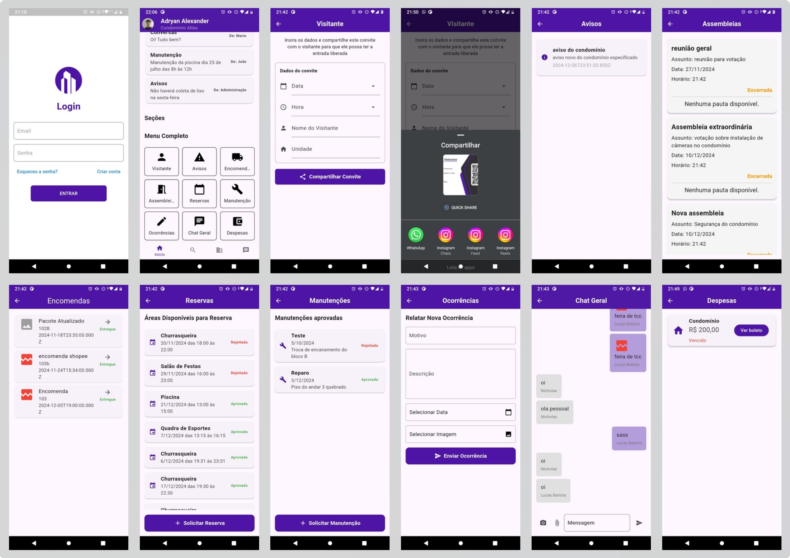

# Condoview - App e Sistema de Condomínio (TCC)

Este projeto foi desenvolvido como Trabalho de Conclusão de Curso (TCC), visando atender tanto *****moradores**** quanto ****síndicos**** de um condomínio. A aplicação ****Flutter**** comunica-se com um *****Node.js/MongoDB****, oferecendo recursos como gestão de moradores, reservas de áreas comuns, avisos e muito mais.

---

### :movie_camera: Demonstração em Vídeo

Assista ao vídeo de apresentação do sistema:

[](https://www.youtube.com/watch?v=E2fc69-hLe4 "Clique para assistir")


---

## :wrench: Tecnologias Utilizadas

### Front-end (Flutter)

- **Dart/Flutter**

### Back-end (Node.js)

- **Express**
- **MongoDB**
- **JWT**

---

## :sparkles: Funcionalidades Principais

1. \*********\*****Autenticação de Usuários****\*\*********
   (morador e síndico com permissões diferentes)
2. \*********\*****Cadastro e Consulta de Moradores****\*\*********
3. \*********\*****Reservas****\*\********* de áreas comuns
4. \*********\*****Gestão de Ocorrências****\*\*********

---

## :inbox_tray: Instalação e Execução

### 1. Clonar o Repositório

```bash
git clone https://github.com/LucasBatista37/Condoview-App.git
```

---

### 2. Configurar Variáveis de Ambiente

#### No Back-end

1.  Navegue até a pasta `backend`:

    ```bash
    cd backend
    ```

2.  Crie um arquivo `.env` a partir do exemplo:

    ```bash
    cp .env.example .env
    ```

3.  No arquivo `.env`, preencha as variáveis necessárias, por exemplo:

    ```env
    PORT=5000
    DB_USER=SEU_USUARIO
    DB_PASS=SUA_SENHA
    JWT_SECRET=SUA_CHAVE_SECRETA
    ```

4.  Certifique-se de que o arquivo `.env` está listado no `.gitignore` para não ser comitado.

#### No Front-end (Flutter)

1.  Se o app precisar acessar a API do back-end, crie também um arquivo `.env` na raiz da pasta `frontend`:

    ```bash
    cd ../frontend
    cp .env.example .env
    ```

2.  No arquivo `.env`, defina a variável da base URL, por exemplo:

    ```env
    BASE_URL=http://10.0.1.3:5000
    ```

    > ****Obs:**** Se estiver usando um emulador Android, para acessar o localhost da máquina de desenvolvimento use `10.0.2.2`.

---

### 3. Configurar o Back-end

1.  Navegue para a pasta `backend`:

    ```bash
    cd backend
    ```

2.  Instale as dependências:

    ```bash
    npm install
    ```

    ou

    ```bash
    yarn
    ```

3.  Inicie o servidor:

    ```bash
    npm run dev
    ```

    ou

    ```bash
    yarn dev
    ```

    - Por padrão, o servidor deve rodar em `http://localhost:5000`.

---

### 4. Configurar o Front-end (Flutter)

1.  Navegue para a pasta `condoview`:

    ```bash
    cd ../condoview
    ```

2.  Instale as dependências do Flutter:

    ```bash
    flutter pub get
    ```

3.  Execute o app:

    ```bash
    flutter run
    ```

---

## :handshake: Equipe

- [](https://github.com/LucasBatista37)  
  **Lucas Batista**
  _Função:_ Desenvolvedor Mobile & Front-End  
  GitHub: [@LucasBatista37](https://github.com/LucasBatista37)

- [](https://github.com/adryan-santana-flooxmongagua)  
  **Adryan Alexander**  
  _Função:_ Desenvolvedor Backend & Designer  
  GitHub: [@adryan-santana-flooxmongagua](https://github.com/adryan-santana-flooxmongagua)

- [](https://github.com/NicDeveloper7)  
  **Nicholas Balbino**  
  _Função:_ Desenvolvedor Backend  
  GitHub: [@NicDeveloper7](https://github.com/NicDeveloper7)

- [](https://github.com/Edkarllos)  
  **Edkarllos Fernando**  
  _Função:_ Documentação  
  GitHub: [@Edkarllos](https://github.com/Edkarllos)

- [](https://github.com/Lopezkz)  
  **Pedro Henrique Lopes**  
  _Função:_ Documentação  
  GitHub: [@HenriqueOLopes](https://github.com/Lopezkz)

---

## :movie_camera: Capturas de Tela - Morador



---

## :wave: Contato

Em caso de dúvidas ou sugestões:

- ****E-mail****: [lucas.batista9734@gmail.com](mailto:lucas.batista9734@gmail.com)
- ****LinkedIn****: [www.linkedin.com/in/lucas-batista-004212263/](https://linkedin.com/in/lucas-batista-004212263)
- ****GitHub****: [https://github.com/LucasBatista37](https://github.com/LucasBatista37)
